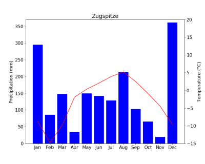

# Exercise 4 (10P)

In the data folder, you can find the recent daily station observations from the DWD for Garmisch-Partenkirchen and the Zugspitze. The data was downloaded from the public DWD opendata-server at:

https://opendata.dwd.de/climate_environment/CDC/observations_germany/climate/daily/kl/recent/

Here you can also find a description of the data format and the station ID's.

1. Clone the repository to your local machine
2. Use the python script "create_climate_diagrams.py" to plot simple climate diagrams of the data.
3. Complete all tasks in the script file and save the resulting figures in the output folder. The figures should look sth. like:

4. Commit and push your changes to github.
